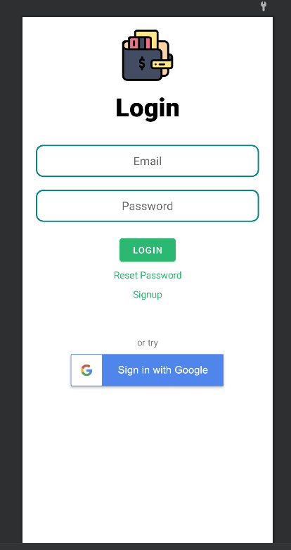
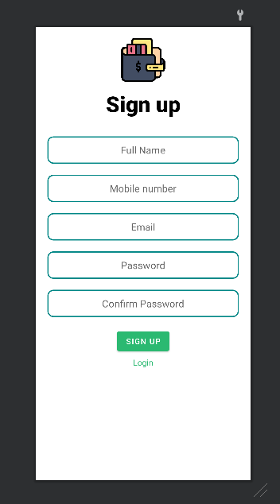
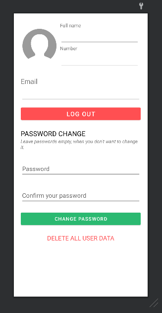

# FinancialApp
## Introduction
This is a financial management Android App i created as a project for Software Engineering subject in university. It uses Firestore as a database and other Firebase tools.

## Images
Here are some images of the app:

## How to install
You can install the app via this link https://drive.google.com/drive/folders/1XohArXckQBwAJgAB_-60qFVFhAkR0rMB?usp=share_link to your Android phone (this app min SDK is 26, so you should install it on a phone with Android 8 or higher).

## Demo video
Follow this link for a short Youtube demo of the app https://youtu.be/sALd7h58STA

## Resources
All vector files in this project is downloaded from https://freeicons.io/.
